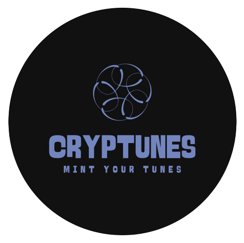

<h1>
 Welcome to Cryptunes
</h1>

[Demo video](https://www.youtube.com/watch?v=3dlE7zb0gWs)

to run on localhost just run :
 
**yarn install**
 
**yarn dev**

Our application is hosted on that link.
 * [dapp link](https://cryptunes.vercel.app/)

Authors
 * [Suhel-Kap](https://github.com/Suhel-Kap)
 * [nijoe1](https://github.com/nijoe1)

## Description
Cryptunes is a decentralized social platform that allows users to create and monetize ERC115 NFT collections as a Space.
Cryptunes offers a range of features, including a Decentralized group chat for each Collection, profiles showcasing users' posts and NFTs using DIDs using the Ceramic Network and the Fantom Blockchain to host our Contract.

The platform supports various NFTs, including :

  * stable diffusion-generated image NFTs using open-AI Dalle-2 APIs
  * Interactive visualizers using the CID of HTML pages
  * audio NFTs
  * image NFTs
  * ticket NFTs

## Technologies
This is how we used Orbis.club(SDK) - IPFS( NFT.STORAGE ) - OpenAI (Dalle2)
  
  
 
 **Orbis SDK** 
  
  
 The Cryptunes platform uses the orbis SDK, built on the Ceramic network, to power its decentralized social platform. Orbis provides us user profiles, posts, and a     Decentralized discord experience for each Collection. All of this information is stored on the Ceramic network to ensure a decentralized and secure environment. Orbis plays a key role in enabling Cryptunes to function as a decentralized social platform and provide a range of features for users to connect and engage with the Cryptuned NFT communities.
         
         **https://github.com/Suhel-Kap/cryptunes/blob/main/pages/api/getSpaces.ts**
          
         **https://github.com/Suhel-Kap/cryptunes/blob/main/pages/api/getProfile.ts**
          
         **https://github.com/Suhel-Kap/cryptunes/blob/main/pages/space.tsx**
          
          
  **NFT.STORAGE**
      
       All the files that consist an NFT are stored on the IPFS network using NFT.STORAGE
       The code snippets that are using NFT.STORAGE modules are located here:
        
        **https://github.com/Suhel-Kap/cryptunes/blob/main/pages/api/uploadToIpfs.ts**
         
        **https://github.com/Suhel-Kap/cryptunes/blob/main/pages/api/uploadMetadata.ts**
         
        **https://github.com/Suhel-Kap/cryptunes/blob/main/pages/api/audioVisual.ts**
     
     
   **OpenAI** 
     
       The Cryptunes platform uses OpenAI Dalle2 APIs for AI Generated Images for Cryptuned AI NFTs.
          
         **https://github.com/Suhel-Kap/cryptunes/blob/main/pages/api/dalle.ts**
          
         **https://github.com/Suhel-Kap/cryptunes/blob/main/pages/ai.tsx**
            
 

## SmartContract

Our contract is deployed and verified on Mantle Testnet here is the Testnet Explorer Link . 
 
**https://explorer.testnet.mantle.xyz/address/0x21686216b87030b3270b1D91901929F45d0F0138/**
 
 The Contract repo link :
 
**https://github.com/Suhel-Kap/cryptunes/blob/main/contract/contracts/Cryptunes.sol**
 

 
 ---
